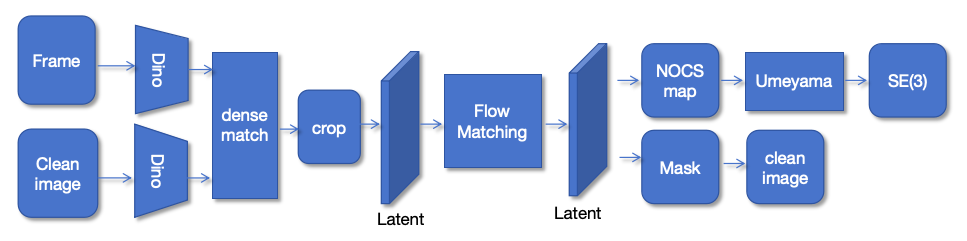

# NocsFM: One-Shot Flow Matching for NOCS-Based 6D Pose Estimation

## Abstract
Accurate pose estimation and tracking are crucial for physical AI systems such as robots. However, existing methods typically require a predefined model or category. In addition, they often rely on manually annotated segmentation masks of the target in the first frame, which is labor-intensive and leads to degraded performance when facing occlusion or fast motion.To address these issues, we propose NocsFM — a novel pose estimation framework. This system adopts a two-stage pipeline that integrates object detection and pose estimation. It can simultaneously detect the target object’s position and generate its mask and NOCS map. The map is then aligned using Umelaya for point-cloud registration to obtain the pose estimation. NocsFM is trained on the Camera dataset and achieves excellent performance.

---

## 1. Introduction
Estimating the six degrees of freedom (6D) rigid-body transformation between an object and a camera—commonly referred to as object pose estimation—is a core problem underpinning a wide range of perception–control tasks in robotics, augmented reality, and human–machine interaction. Despite notable progress in data-driven approaches and deep geometric learning in recent years, existing methods still face structural bottlenecks when deployed in real-world environments.

First, mainstream paradigms are predominantly based on instance-level modeling, in which object-specific features or templates are constructed for predefined targets. Such paradigms lack invariance to shape and topology, leaving the models poorly generalizable when confronted with novel categories or significant appearance variations. Second, many approaches rely heavily on strong priors or manual interventions, such as precisely annotated object masks, bounding boxes, or initial pose information, to guarantee convergence of subsequent geometric optimization. These strict prior requirements not only increase the human and perceptual cost of deployment but also substantially degrade robustness under occlusion, fast motion, or illumination changes. At their root, these limitations reflect a structured dependence of model inputs on high-quality reference information, which stands in sharp contrast to the open-world requirement for annotation-free and template-free operation.

Moreover, a large body of existing algorithms still presupposes access to accurate 3D CAD models or high-fidelity geometric templates of the target objects. While such assumptions may hold in controlled laboratory settings, they are prohibitively expensive and unsustainable in large-scale industrial or unstructured outdoor scenarios: they inflate the cost of data acquisition, modeling, and storage, and they curtail real-time adaptability and reconfigurability in dynamic or cluttered environments. To address these challenges, researchers have explored two promising directions:

- **Flow matching**, a recent generative technique for learning continuous transformations, provides a powerful way to model the dense correspondence between 2D image observations and 3D object geometry, thereby improving both pose estimation accuracy and robustness to occlusion.
- **Normalized Object Coordinate Space (NOCS)** representations map every object pixel to a normalized canonical space, enabling category-level generalization and metric-scale 6D pose recovery without the need for exact 3D models.

Combining these strengths offers a compelling path forward for practical industrial applications.

In this study, we propose NocsFM—a unified framework for category-level 6D pose estimation and persistent object tracking. Our approach fully exploits the high-dimensional, cross-view invariant semantic representations provided by DINOv3 to achieve robust multi-view association and feature correspondence. Building on this foundation, it seamlessly integrates generative flow matching with Normalized Object Coordinate Space (NOCS) representations, establishing an end-to-end geometric reasoning pipeline that maps a single RGB reference image to metric-scale 3D space. Through this pipeline, NocsFM simultaneously performs object mask prediction, category-level NOCS mapping, and rigid 6D pose estimation without requiring any object-specific CAD models or pre-defined templates. Furthermore, the system leverages the predicted masks as an online feedback signal to realize adaptive cross-frame association and robust long-term tracking, thereby completely eliminating manual re-initialization and maintaining high accuracy under dynamic occlusions and complex backgrounds.

**Main contributions:**
- **Unified framework for pose estimation and tracking.** Requires only one reference image to continuously track objects and estimate their 6D poses in real time.
- **First use of flow matching on NOCS.** Pioneers the application of flow matching within the NOCS representation, enabling robust and category-level 6D pose estimation directly from RGB images.
- **Joint mask prediction and pose estimation.** Couples mask prediction with pose estimation, enabling fully automated object tracking and reducing the dependency on external detectors or handcrafted priors.

By unifying feature matching, flow-based geometric reasoning, and NOCS-based 3D representation, **NocsFM** advances object pose estimation towards truly generalizable and deployment-ready solutions for robotics, augmented reality, and industrial automation.

---

## 2. Related Work

### 2.1 6D Pose Estimation
6D object pose estimation aims to recover the full 3D translation and rotation of a target from one or more RGB/RGB-D images, and serves as a core technology in robotic manipulation, augmented reality, and industrial automation (Hodan et al., 2018). Existing approaches can broadly be categorized into geometry-/template-based methods and learning-based methods. Geometry- and template-based approaches typically rely on known CAD models and classical geometric optimization. Early work exploited keypoint matching and Perspective-n-Point (PnP) solutions (Lepetit et al., 2009) or Iterative Closest Point (ICP) registration for fine alignment (Besl & McKay, 1992). Later studies improved robustness with enhanced feature extraction and contour constraints to handle occlusion and background clutter (Kehl et al., 2017; Xiang et al., 2017). Despite these improvements, such methods remain sensitive to lighting variation, partial occlusion, and previously unseen objects, and they require precise 3D CAD models, which hampers deployment in open-world scenarios. Deep learning approaches leverage CNN or Transformer architectures to directly regress object pose or detect 2D/3D keypoints, significantly improving robustness and accuracy. Representative methods include PoseCNN (Xiang et al., 2018), which predicts dense keypoints for end-to-end 6D pose estimation; PVNet (Peng et al., 2019) and GDR-Net (Wang et al., 2021), which further enhance resilience to occlusion and noise; and Transformer-based frameworks that incorporate strong global reasoning (Lin et al., 2022; Li et al., 2022). Nevertheless, these methods typically demand large-scale annotated datasets, instance-level 3D models, or multi-view priors, and their ability to generalize to novel object categories remains limited. Recent research integrates large-scale vision foundation models and generative paradigms to overcome these limitations. For example, FoundationPose (Ichnowski et al., 2023) exploits pre-trained universal visual features and multi-view consistency to achieve 6D pose estimation without requiring instance-specific CAD models, while DiffusionNOCS (Liu et al., 2023) combines diffusion-based generative modeling with the Normalized Object Coordinate Space (NOCS) representation to improve category-level generalization and data efficiency. These advances illustrate the potential of generative distribution learning and cross-modal priors for breaking the long-standing dependency on detailed geometric templates.

### 2.2 FoundationPose
FoundationPose represents a recent effort to incorporate large-scale vision foundation models into the 6D object pose estimation pipeline. By employing extensively pre-trained visual backbones as general-purpose feature extractors and fine-tuning with limited task-specific data, it achieves strong data efficiency and category-level generalization. Nevertheless, FoundationPose typically relies on accurate 3D CAD models or precise category annotations to initialize and constrain pose optimization, and its performance can degrade markedly in dynamic scenes characterized by fast motion, large viewpoint changes, or severe occlusion. These requirements restrict its applicability in fully open-set or real-time interactive environments. In sharp contrast, our proposed NocsFM does not require any object-specific 3D models or category labels. By tightly integrating flow matching with the Normalized Object Coordinate Space (NOCS) representation, NocsFM performs end-to-end inference from a single reference RGB image to category-level 6D pose estimation. The method automatically predicts object masks and supports continuous real-time tracking, completely eliminating the need for manual re-initialization and maintaining stable accuracy even under rapid motion or heavy occlusion. These properties make NocsFM particularly well suited to high-robustness, low-prior-dependency applications in robotic manipulation, augmented reality, and industrial automation.

### 2.3 DiffusionNOCS
DiffusionNOCS is a recent exploration of applying generative diffusion models to category-level 6D object pose estimation. By tightly coupling diffusion models with the Normalized Object Coordinate Space (NOCS) representation, it progressively denoises through reverse diffusion to generate normalized object coordinate fields, enabling explicit reconstruction of 3D geometry and pose without requiring precise CAD models. Compared with direct regression approaches, this generative paradigm demonstrates stronger geometric consistency and category-level generalization when dealing with significant shape variation or non-rigid deformations.However, DiffusionNOCS has several notable limitations. First, it requires accurate category labels to guide NOCS normalization and conditional modeling, restricting its applicability in open-set or unknown-category environments. Second, diffusion sampling can only be applied to cleanly segmented images, lacking inherent object detection or segmentation capability and thus relying on external detectors or manual masks. Third, the multi-step diffusion process incurs high computational cost and long inference time, and is prone to instability under noise, heavy occlusion, or cluttered backgrounds. These drawbacks limit its suitability for real-time robotic manipulation or augmented-reality applications that demand low latency.By contrast, our proposed NocsFM follows a different paradigm: it requires neither object-specific 3D models nor category labels and can directly generate masks and track object poses in real time from a single reference image, offering stronger practicality in dynamic and complex environments.

---

## 3. Method
NocsFM achieves model-free 6D pose estimation and real-time tracking within a single unified loop, requiring only a clean reference image of the target object and the current RGB frame as input. The system first employs DINOv3 pre-trained visual features to perform cross-view matching between the reference and current frames, automatically localizing the target in cluttered scenes and establishing an initial position together with reliable inter-frame correspondences. Next, it performs geometric reasoning by integrating latent flow matching with the Normalized Object Coordinate Space (NOCS) representation, mapping image pixels in the current frame directly to a normalized 3D coordinate space and estimating the object’s 6D pose through robust Umeyama optimization. Finally, a mask-based closed-loop mechanism continuously updates the target’s position and appearance features, enabling uninterrupted real-time tracking without manual intervention. Thanks to this end-to-end design, NocsFM can deliver stable and accurate pose and trajectory estimates in dynamic, cluttered environments without any object-specific 3D models or category labels.

### 3.1 DINOv3 Matching
Given a clean reference image `I_ref` and the current RGB frame `I_t`,  
**NocsFM** first employs **DINOv3** as a visual backbone to extract multi-scale features from both images, yielding dense feature embeddings with spatial position encoding:

where `C` is the channel dimension and `H_s`, `W_s` denote the downsampled spatial resolution.

Next, a dense cross-image similarity map is constructed using cosine similarity:

=\max_{(i,j)}\frac{\langle\hat{\Phi}_{\mathrm{ref}}(:,i,j),\hat{\Phi}_t(:,u,v)\rangle}{\|\hat{\Phi}_{\mathrm{ref}}(:,i,j)\|_2\cdot\|\hat{\Phi}_t(:,u,v)\|_2})

where  denotes L2-normalized feature vectors.

To improve matching reliability, **mutual nearest neighbor (MNN)** filtering is applied, retaining only pairs that are each other’s nearest matches:

%5Cmid%20(i%2Cj)%3D%5Carg%5Cmax_%7Bi%27%2Cj%27%7D%20S_%7Bt%5Cto%5Cmathrm%7Bref%7D%7D(u%2Cv%2Ci%27%2Cj%27)%20%5Cland%20(u%2Cv)%3D%5Carg%5Cmax_%7Bu%27%2Cv%27%7D%20S_%7B%5Cmathrm%7Bref%7D%5Cto%20t%7D(i%2Cj%2Cu%27%2Cv%27)%5C%7D)

By thresholding the similarity map `S` and performing connected-component analysis,  
the method obtains a foreground mask `M_t ⊆ [1,H] × [1,W]` of the target in the current frame.  
The target center can then be computed, for example, by the bounding box of `M_t` or a soft-argmax over high-confidence regions,  
and the corresponding object region is cropped as

This cropped image is subsequently fed to the **flow matching** module for Normalized Object Coordinate Space (NOCS) estimation and final 6D pose recovery.
### 3.2 Flow Matching for NOCS Estimation
The cropped object patch \(I_t^{crop}\) is fed into a **latent flow matching** network to establish dense correspondences between image observations and the **Normalized Object Coordinate Space (NOCS)**.

First, an encoder maps the cropped image to a latent representation:

)

Introducing a continuous time parameter \(t\in[0,1]\), the network learns a conditional vector field that drives the temporal evolution of latent variables:

%20%5Capprox%20%5Cfrac%7B%5Cpartial%20z_t%7D%7B%5Cpartial%20t%7D)

By integrating this field in a single forward pass, the latent code is transported to a canonical representation:

%20dt)

A decoder then maps the transformed latent variable to a dense NOCS map:

)

Simultaneously, a foreground mask is predicted:

)

Where  
* `N_t` (H×W×3) is a **dense NOCS map** for accurate 6D pose recovery.  
* `M_t` is a **foreground mask** delineating the object.

Unlike diffusion-based methods that rely on multi-step stochastic denoising, **latent flow matching** performs the observation-to-NOCS transformation in **one deterministic pass**, ensuring both **high geometric precision** and **real-time efficiency**.

This one-shot process ensures precision and real-time efficiency.

### 3.3 Tracking with Mask Feedback
The predicted foreground mask serves not merely as a per-frame output but also as a key structural component of the geometry–tracking pipeline. Firstly，by separating the object from a cluttered background at pixel-level precision, the mask provides  
    observations for downstream 6D pose estimation, effectively suppressing background noise and improving geometric accuracy.
Secondly，the mask is further used to automatically crop a new high-quality reference image  
   ,which captures the object’s latest appearance and scale.  This freshly generated reference is fed back into the next round of DINOv3 cross-view feature matching, continuously refreshing the system’s memory of the target.Through this predict-mask → update-reference → re-match cycle, **NocsFM** forms a closed-loop, temporally adaptive tracking system capable of long-term, fully automated operation without manual re-initialization, even under appearance changes or environmental disturbances.

---

## 4. Experimental Evaluation

### 4.1 Setup
Experiments were conducted on a workstation with:
- NVIDIA RTX 3090 GPU (24 GB memory)
- Intel Xeon 3.0 GHz CPU
- 128 GB RAM

The method is implemented in PyTorch, using DINOv3 for feature extraction and a customized flow matching network for NOCS prediction and pose estimation. Training and evaluation were performed on the **CAMERA** dataset.

### 4.2 Evaluation of DINOv3 Matching
DINOv3, trained with a reference-to-frame matching objective, demonstrated robust object localization across diverse conditions, confirming its effectiveness as the first stage of NocsFM.

### 4.3 Evaluation of Flow Matching for Pose Estimation
Flow matching accurately predicted dense NOCS maps and masks, enabling stable pose estimation without iterative sampling. This supports real-time operation when integrated into the full NocsFM pipeline.

---

## 5. Conclusion
We presented **NocsFM**, a unified framework for category-level 6D object pose estimation and tracking from RGB input. By combining DINOv3-based feature matching, one-shot flow matching for NOCS prediction, and a mask-driven feedback loop, NocsFM requires only a single reference image and no CAD models while operating in real time. Experiments on the CAMERA dataset demonstrate accurate pose estimation and robust long-term tracking, advancing 6D pose estimation toward practical, deployment-ready applications.
